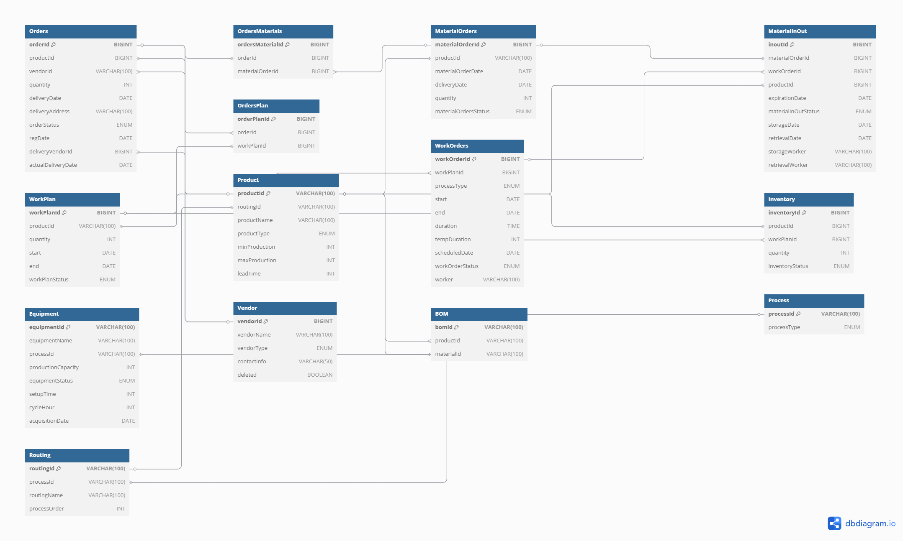

# 📌 MES 시스템 - 생산 관리 시스템

## 🏭 프로젝트 개요

**MES (Manufacturing Execution System)** 프로젝트는 **공장의 생산 관리 자동화**를 목표로 하는 시스템입니다.  
기존의 **수작업 기반 관리 방식**에서 벗어나, **자동화된 생산 일정 및 자재 관리 시스템**을 통해 **효율적인 제조 공정**을 지원합니다.

---

## 🎯 기획 의도

### **📌 Insight**

✅ **생산 일정 및 공정 관리를 자동화**하여 불필요한 시간과 비용을 절감  
✅ **실시간 재고 및 원자재 관리**를 통해 불필요한 낭비 감소  
✅ **출하 및 납기 일정 관리 최적화**로 고객 신뢰도 향상

### **핵심 기능**

- **Keyword 1:** 생산 공정 자동화 (작업 계획 및 지시)
- **Keyword 2:** 자재 및 재고 관리 (입출고 현황 실시간 확인)
- **Keyword 3:** 생산 이력 추적 (원자재 입고부터 출하까지 전 과정 기록)

---

## 📌 프로젝트 소개

### **주요 기능**

✅ **수주 관리:** 주문 등록 및 납기 일정 자동 계산  
✅ **자재 관리:** 원자재 발주 및 재고 관리 최적화  
✅ **생산 계획:** 공정 순서에 따른 작업 일정 자동 생성  
✅ **작업 지시:** 공정별 작업 지시 및 진행 상태 관리  
✅ **출하 관리:** 제품 출하 및 배송 일정 관리  
✅ **현황 분석:** 생산량, 재고 현황, 출하 데이터 시각화  
✅ **이력 추적:** 원자재 입고부터 출하까지 모든 이력 관리

---

## 🛠 개발 환경

|프로그래밍 언어|백엔드 프레임워크|프론트엔드|데이터베이스|
|---|---|---|---|
|Java 17|Spring Boot|Thymeleaf, HTML, CSS, JavaScript|MySQL, JPA (Hibernate)|

---

## 🏗 시스템 구조도

```
메인 화면
│
├── 수주 관리
│   ├── 주문 등록
│   ├── 납기 일정 예측
│
├── 자재 관리
│   ├── 원자재 발주 및 입출고
│   ├── 재고 부족 시 자동 발주
│
├── 생산 관리
│   ├── 작업 계획 자동 생성
│   ├── 공정별 작업 지시
│
├── 출하 관리
│   ├── 제품 출하 처리
│   ├── 배송 현황 관리
│
└── 현황 분석 및 이력 관리
    ├── 생산량 및 재고 현황 시각화
    ├── 제품 및 원자재 이력 추적
```

---

## 📂 ERD (Entity Relationship Diagram)

MES 시스템의 데이터베이스 구조는 다음과 같이 설계되었습니다.



---

## 🎨 UI 화면 구성

### **📌 수주 및 출하 관리 (주문 등록 및 조회)**


---

### **📌 자재 관리 (발주 및 입출고 현황)**


---

### **📌 생산 관리 **


---

### **📌 현황 분석 (재고 및 생산량 시각화)**


---

### **📌 이력 관리 (제품 생산 및 출하 추적)**


---

## 🎯 **기대 효과**

🚀 **정확한 생산 일정 및 납품 예측으로 신뢰성 향상**  
🚀 **자재 관리 최적화를 통한 불필요한 비용 절감**  
🚀 **생산 공정 자동화를 통한 운영 효율 극대화**  
🚀 **실시간 데이터 분석을 통한 의사 결정 지원**
